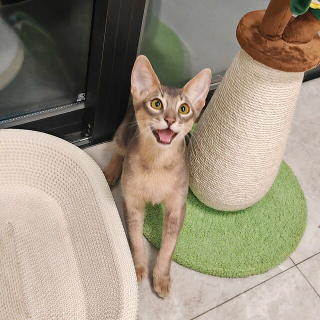
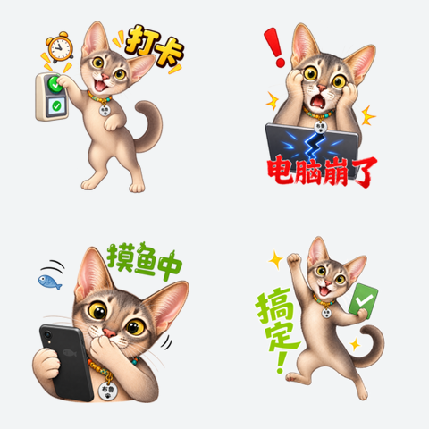
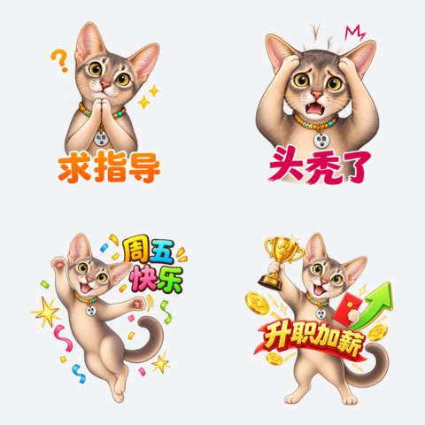
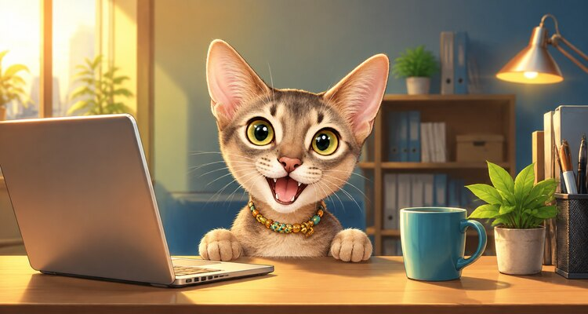
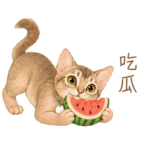
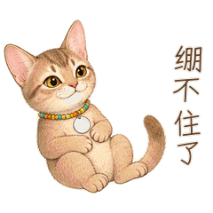
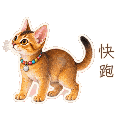
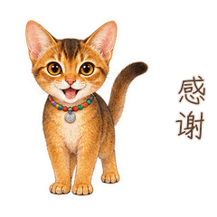

<p align="center">
  <strong>English</strong> · <a href="README_zh.md">中文</a>
</p>

<p align="center">
  
</p>

<h1 align="center">WeChat Pet Sticker Designer</h1>

<p align="center">
  <strong>Turn your pet into a tiny reaction star: judging, snacking, sprinting, and rolling with laughter 🐾</strong><br>
  Static stickers or GIFs—your pet brings the attitude, this skill handles the fiddly bits.
</p>

<p align="center">
  
  
  
  
  
  <a href="LICENSE"></a>
</p>

<p align="center">
  <a href="#overview">Overview</a> ·
  <a href="#compatible-tools">Compatible Tools</a> ·
  <a href="#input-output-example">Input → Output</a> ·
  <a href="#animated-showcase">Animated Showcase</a> ·
  <a href="#workflow">Workflow</a> ·
  <a href="#deliverables">Deliverables</a> ·
  <a href="#quick-start">Quick Start</a> ·
  <a href="#validation">Validation</a> ·
  <a href="#repository-map">Repository</a> ·
  <a href="#license">License</a>
</p>


> [!NOTE]
> There is no Pet Sticker Compliance Committee here. Scripts count pixels, frames, and file sizes; you answer the only two important questions: **Is that still my pet? Is it funny enough?**

<a id="overview"></a>
## 🐾 Overview

PetSticker does one delightful job: it turns your pet's signature faces, suspicious side-eyes, and completely unnecessary little movements into stickers you can actually use in chat. It makes static PNGs and animated GIFs, while keeping an eye on mood-killers such as a surprise fifth leg, wandering captions, fake transparency, or a cat that changes identity halfway through the album.

| What you want | How the skill helps | What you get |
| --- | --- | --- |
| Keep it recognizably yours | Remember the face, markings, proportions, tail, collar, and name tag | 24 jokes without accidentally casting 24 different cats |
| Avoid surprise mutations | Check legs, paws, tails, prop contact, and action logic | No bonus limbs, duplicate tails, or watermelon passing through paws |
| Keep captions readable and still | Use short copy; typeset separately and lock it when needed | Clear text that does not dance around the GIF |
| Make the background truly transparent | Inspect alpha and edge colors | No white boxes, green fringe, or pretend checkerboards |
| Move the pet, not the whole canvas | Generate real action drawings and check timing and loops | The pet performs while the frame stays put |
| Keep the files tidy | Check counts, dimensions, formats, names, and folders | A neat little album instead of a desktop crime scene |

<a id="compatible-tools"></a>
## 🤖 Which AI tools can use it?

PetSticker's workflow and scripts are not tied to ChatGPT or Codex. Any AI assistant that can read this repository, use image generation or editing capabilities, and run Python scripts when needed can help put your pet into the chat box.

- [ChatGPT](https://chatgpt.com/) / [Codex](https://openai.com/codex/);
- [Claude Code](https://code.claude.com/docs/en/overview);
- [TRAE](https://www.trae.ai/ide/), [Cursor](https://www.cursor.com/), and [Kiro](https://kiro.dev/);
- [ZCode](https://zcode.z.ai/en) and [OpenCode](https://github.com/anomalyco/opencode);
- plus similar AI coding assistants that can read repository instructions, work with images, and execute scripts.

> [!TIP]
> If your tool supports Skills natively, install or load the whole repository. If it does not, open the repository as a project and ask the agent to read [`SKILL.md`](SKILL.md) plus the relevant files under `references/`. Image generation and background-removal capabilities come from whichever model, plugin, API, or local tool you use.

<a id="input-output-example"></a>
## 🖼️ Input → output example: 布鲁 · Workplace

Meet Bulu. One photo is enough to remember those huge upright ears, warm gray-brown coat, light build, and expressive face—then send the poor cat into a complete set of office adventures.

### 📸 Input reference

<p align="center">
  
</p>

<p align="center"><sub>Bulu, moments before learning that the cat now has an office job.</sub></p>

<p align="center"><strong>↓ Meet the cat → Plan the jokes → Draw small batches → Spot the weird bits ↓</strong></p>

### 💬 Output sticker selection

| Daily work moments | Support, pressure, and milestones |
| --- | --- |
|  |  |

<p align="center"><sub>Eight picks from the 24-sticker album. The others are busy pretending to work.</sub></p>

### 🏙️ Companion detail banner

<p align="center">
  
</p>

Yes, the cat is working harder than we are.

<a id="animated-showcase"></a>
## 🎬 Animated showcase: 布鲁 · Chinese internet reactions

The cat performs; the caption stays put. These four GIFs were made with this skill: 240×240, 12 directly generated action drawings, a complete 2.00-second loop, real transparency, and less than 500 KB each. No RIFE, no optical-flow interpolation, and no cheating by shaking the entire sticker.

<table>
  <tr>
    <td align="center"><strong>Eating watermelon｜prop contact and chewing</strong><br></td>
    <td align="center"><strong>Cannot stop laughing｜full-body rolling laugh</strong><br></td>
  </tr>
  <tr>
    <td align="center"><strong>Run｜continuous running poses</strong><br></td>
    <td align="center"><strong>Thanks｜complete bowing loop</strong><br></td>
  </tr>
</table>

Curious how the cat actually gets moving? [`references/animated-stickers.md`](references/animated-stickers.md) covers action planning, direct frame generation, caption locking, transparency cleanup, GIF timing, and repairs.

<a id="workflow"></a>
## 🧩 How the cat gets into your chat

```text
[One good pet photo]
      |
      v
[Tiny character guide] -> [24 jokes + actions] -> [Draw small batches]
                                                     |
                                                     v
                                                [Spot checks]
                                                |           |
                                              whoops       nice!
                                                |           |
                                                v           v
                                        [Fix just this one] [Pack it up]
                                                |
                                                +------> one more look
```

The spot-checking happens in three quick rounds:

| Round | What to look at | Send it back when |
| --- | --- | --- |
| **1. Is that still your pet?** | Face, markings, eyes, ears, proportions, paws, tail, and accessories | The pet changes identity, size, markings, collar, or tag |
| **2. Did anything mutate?** | Limb and tail count, crops, prop contact, pose, caption, and variety | Extra limbs, duplicate tails, fused parts, impossible actions, or confusing text |
| **3. Are the files behaving?** | Count, dimensions, format, transparency, size, naming, folders, and manifests | Something is missing, mis-sized, fake-transparent, or incorrectly named |

Fix the odd sticker, not the entire cat family. Scripts can count and inspect files, but humans still decide whether it looks right and lands the joke.

<a id="deliverables"></a>
## 📦 What's in the cat bundle?

A complete static album normally includes:

| Asset | Default count | Notes |
| --- | ---: | --- |
| Independent sticker PNGs | 24 | Different expressions, poses, and messaging contexts |
| Character avatar | 1 | Transparent 240 × 240 PNG |
| Detail banner | 1 | Opaque 750 × 400 image; head-and-shoulders composition is preferred |
| Album cover | 1 | Transparent 240 × 240 PNG |
| Chat icon | 1 | Transparent 50 × 50 PNG |
| Tipping prompt | Optional 1 | 750 × 560 image |
| Tipping thanks | Optional 1 | 750 × 750 image |
| Manifest, tiny character guide, check report | 3 | So future-you can find and repair things without losing nine lives |

The default release structure is:

```text
project/
├── references_private/        # Reference photos: the actual star
├── work/                      # Drafts, working art, and repair zone
└── release/
    ├── stickers/              # 01_*.png … 24_*.png, ready to make an entrance
    ├── assets/
    │   ├── character_avatar.png
    │   ├── detail_banner.jpg
    │   ├── album_cover.png
    │   ├── chat_icon.png
    │   ├── tipping_prompt.jpg # optional
    │   └── tipping_thanks.jpg # optional
    ├── manifest.json
    ├── character_bible.md
    └── qa_report.md
```

<a id="quick-start"></a>
## 🚀 Three-step setup

### 1. 📥 Clone the skill

```bash
git clone https://github.com/rudykon/PetSticker.git
cd PetSticker
```

In tools with native Skills support, install or load the whole repository as one skill. In other AI coding assistants, open this repository and ask the agent to read `SKILL.md` first. Either way, keep `SKILL.md`, `agents/`, `assets/`, `references/`, and `scripts/` together—do not scatter the cat's toolbox.

### 2. 🧰 Install the validator dependency

```bash
python3 -m pip install Pillow
```

### 3. 🐱 Invoke the skill

```text
$wechat-pet-sticker-designer
```

If the current tool does not support `$skill-name` invocation, plain language works too:

```text
Read SKILL.md and the references needed for this task, then follow the repository
workflow to create a static or animated WeChat sticker album from my pet references.
```

Example request:

```text
Use $wechat-pet-sticker-designer and my uploaded pet references to create a
submission-ready static WeChat sticker album. Preserve the approved body
proportions and name tag, use real transparency, and review every asset for
extra limbs, duplicate tails, incorrect Chinese text, and style drift.
```

Unless a missing choice would genuinely change the result, the skill meets your pet, plans the full set, and starts with a small batch. Check the vibe first; launch the cat's full reaction career second.

<a id="validation"></a>
## 🔍 Let scripts count; do not let them judge the cat

Dimensions, counts, frames, and filenames get boring fast. Hand those jobs to the script:

```bash
python3 scripts/validate_album.py /absolute/path/to/project/release \
  --expected-stickers 24 \
  --with-tipping \
  --require-qa-docs
```

Then line up all 24 stickers on one page and spot the one whose cat identity wandered off:

```bash
python3 scripts/make_contact_sheet.py \
  /absolute/path/to/project/release/stickers \
  /absolute/path/to/qa_overview.png
```

Add `--json` for machine-readable output. GIF albums can also check frame count, speed, complete looping, and per-frame transparency:

```bash
python3 scripts/validate_album.py /absolute/path/to/project/release \
  --expected-stickers 24 --allow-gif-stickers \
  --gif-frames 12 --gif-loop-ms 2000 \
  --require-infinite-loop --require-transparent-gif \
  --require-clear-gif-edges --require-qa-docs

python3 scripts/make_animation_sheet.py \
  /absolute/path/to/project/release/stickers \
  /absolute/path/to/all_frames.png --expected-frames 12
```

<a id="repository-map"></a>
## 🗺️ Want to poke around? Here's the map

| Path | Purpose |
| --- | --- |
| [`SKILL.md`](SKILL.md) | The main pet-to-sticker recipe and its important rules |
| [`agents/openai.yaml`](agents/openai.yaml) | Skill display name, default prompt, product policy, and icon mapping |
| [`references/wechat-assets.md`](references/wechat-assets.md) | WeChat asset dimensions, formats, transparency, and size guidance |
| [`references/character-and-prompts.md`](references/character-and-prompts.md) | Character bible, prompting, Chinese typography, and repair strategy |
| [`references/animated-stickers.md`](references/animated-stickers.md) | Semantic frame planning, direct generation, transparency repair, animation QA, and optimization |
| [`references/qa-and-delivery.md`](references/qa-and-delivery.md) | Final spot-checking, repair, and tidy-up guidance |
| [`assets/`](assets) | Character bible, manifest, QA report templates, and skill icon |
| [`scripts/validate_album.py`](scripts/validate_album.py) | Deterministic album and image-file validation |
| [`scripts/make_contact_sheet.py`](scripts/make_contact_sheet.py) | Numbered visual overview generation |
| [`scripts/make_animation_sheet.py`](scripts/make_animation_sheet.py) | Row-by-row, frame-by-frame animated QA sheet generation |

<a id="license"></a>
## 📜 License

The original instructions, templates, and scripts use the [MIT License](LICENSE). Pet photos, finished sticker art, fonts, and third-party materials follow their own terms. In short: **the code is here to play with; everybody keeps their own cat.**
