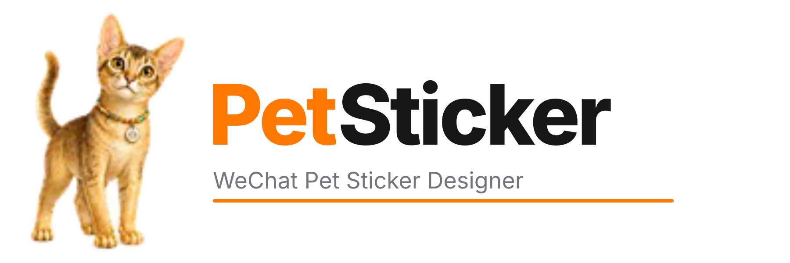
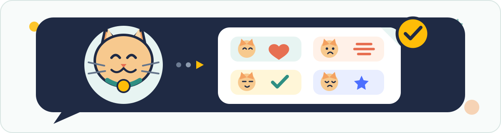

<p align="center">
  <a href="README.md">English</a> · <strong>中文</strong>
</p>

<p align="center">
  
</p>

<h1 align="center">微信宠物表情包设计</h1>

<p align="center">
  <strong>身份锚定设计、三层质量门禁、可审计交付</strong><br>
  将宠物参考图转化为形象一致、可逐图审查、符合微信素材规格的专属表情包。
</p>

<p align="center">
  
  
  
  
  <a href="LICENSE"></a>
</p>

<p align="center">
  <a href="#概览">概览</a> ·
  <a href="#工作流">工作流</a> ·
  <a href="#交付内容">交付内容</a> ·
  <a href="#快速开始">快速开始</a> ·
  <a href="#自动校验">自动校验</a> ·
  <a href="#仓库地图">仓库地图</a> ·
  <a href="#许可证">许可证</a>
</p>

<p align="center">
  
</p>

> [!IMPORTANT]
> **这是一套质量受控的完整工作流，不是一键批量出图工具。** 自动脚本只能验证确定性的文件要求，不能自动证明图片的解剖、身份、体型、语义或中文文字正确。正式交付前必须依照文档逐张人工审查，并以微信表情开放平台的最新官方要求为准。

<a id="概览"></a>
## 概览

本 Skill 形成完整的 **设计 → 生成 → 审查 → 规格化 → 打包** 闭环。它以真实宠物照片或用户批准的角色图为身份锚点，把整套专辑拆分为独立素材，采用小批次生成，并在发布前阻断多肢、多尾、错字、伪透明和体型漂移等缺陷。

| 目标 | 方法 | 结果 |
| --- | --- | --- |
| 保持宠物身份一致 | 在角色圣经中锁定脸型、花色、体型、尾巴、项圈和名牌 | 所有场景保持可识别的同一角色 |
| 避免结构性错误 | 在原始分辨率检查肢体/尾巴数量、连接点、道具关系、裁切和动作语义 | 不出现多脚、双尾、融合部件或不可能动作 |
| 保证小尺寸可读 | 仅在提升语义时使用短中文或通用符号；生成不稳定时确定性排字 | 没有乱码、形近错字和随机英文 |
| 保证真实透明 | 检查 Alpha 通道，并在彩色底上检查白边、灰边和方形底板 | 获得干净透明、无伪棋盘格的 PNG |
| 形成平台可交付文件 | 检查数量、尺寸、格式、透明度、命名、清单和 QA 文档 | 获得可审计、可终检的发布目录 |

仓库只包含通用说明、模板和校验工具，**不包含**任何私人宠物照片或已生成的表情专辑。

<a id="工作流"></a>
## 工作流

```text
[宠物参考图]
      |
      v
[角色圣经] -> [素材规划] -> [小批次生成]
                              |
                              v
                         [三层质量门禁]
                            |       |
                          失败      通过
                            |       |
                            v       v
                       [返修单图] [校验并发布]
                            |
                            +------> 返回质量门禁
```

三层阻断性门禁如下：

| 门禁 | 检查内容 | 阻断性缺陷 |
| --- | --- | --- |
| **1. 身份与体型门** | 脸型、花色、眼睛、耳朵、胸腹厚度、头身比、腿爪、尾巴和配饰 | 形象漂移、过胖/过瘦、花纹改变、名牌或项圈错误 |
| **2. 结构与语义门** | 肢体/尾巴数量与连接、裁切、道具接触、姿势、文案、符号和专辑内区分度 | 多肢、双尾、部件融合、不可能动作、错字或语义不清 |
| **3. 文件规格门** | 数量、像素、格式、Alpha/不透明、大小警告、命名、目录、清单和 QA 文档 | 文件缺失、尺寸错误、伪透明、JSON 无效或命名错误 |

任何失败都只返修对应文件，随后重新通过三层门禁。脚本通过不能替代人工视觉审查。

<a id="交付内容"></a>
## 交付内容

默认一套完整静态专辑包含：

| 素材 | 默认数量 | 说明 |
| --- | ---: | --- |
| 独立表情 PNG | 24 | 覆盖不同情绪、姿势和聊天语境 |
| 表情形象头像 | 1 | 透明 240 × 240 PNG |
| 详情页横幅 | 1 | 不透明 750 × 400；优先头肩或胸像构图 |
| 表情封面图 | 1 | 透明 240 × 240 PNG |
| 聊天页图标 | 1 | 透明 50 × 50 PNG |
| 赞赏引导图 | 可选 1 | 750 × 560 |
| 赞赏致谢图 | 可选 1 | 750 × 750 |
| 素材清单、角色圣经、QA 报告 | 3 | 记录生成、审查和交付依据 |

默认发布目录：

```text
project/
├── references_private/        # 原始宠物照片；不进入公开分享包
├── work/                      # 高分辨率工作源、草稿和返修稿
└── release/
    ├── stickers/              # 01_*.png … 24_*.png
    ├── assets/
    │   ├── character_avatar.png
    │   ├── detail_banner.jpg
    │   ├── album_cover.png
    │   ├── chat_icon.png
    │   ├── tipping_prompt.jpg # 可选
    │   └── tipping_thanks.jpg # 可选
    ├── manifest.json
    ├── character_bible.md
    └── qa_report.md
```

<a id="快速开始"></a>
## 快速开始

### 1. 克隆 Skill

```bash
git clone https://github.com/rudykon/wechat-pet-sticker-designer.git
cd wechat-pet-sticker-designer
```

在支持 Skills 的 ChatGPT/Codex 环境中，将整个仓库作为一个 Skill 安装或加载。请保持 `SKILL.md`、`agents/`、`assets/`、`references/` 和 `scripts/` 位于同一目录层级。

### 2. 安装校验脚本依赖

```bash
python3 -m pip install Pillow
```

### 3. 调用 Skill

```text
$wechat-pet-sticker-designer
```

示例请求：

```text
使用 $wechat-pet-sticker-designer，根据我上传的宠物参考图制作一套可提交
微信平台的静态表情包。保持已确认的体型和名牌，使用真实透明背景，并逐图
检查多肢、多尾、中文错字和风格漂移。
```

只有在缺少会显著改变结果的关键选择时，Skill 才会提问；否则会直接建立角色圣经、规划完整素材清单，并从可审查的小批次开始。

<a id="自动校验"></a>
## 自动校验

校验包含赞赏素材和必需 QA 文档的完整专辑：

```bash
python3 scripts/validate_album.py /absolute/path/to/project/release \
  --expected-stickers 24 \
  --with-tipping \
  --require-qa-docs
```

生成带编号的表情总览图，用于人工终检：

```bash
python3 scripts/make_contact_sheet.py \
  /absolute/path/to/project/release/stickers \
  /absolute/path/to/qa_overview.png
```

需要机器可读报告时添加 `--json`。若微信当前规范允许动态表情，可使用 `--allow-gif-stickers` 将 GIF 纳入校验。

<a id="仓库地图"></a>
## 仓库地图

| 路径 | 用途 |
| --- | --- |
| [`SKILL.md`](SKILL.md) | 主工作流、质量门禁、交付规则和强制停止条件 |
| [`agents/openai.yaml`](agents/openai.yaml) | Skill 显示名称、默认提示词、产品策略和图标映射 |
| [`references/wechat-assets.md`](references/wechat-assets.md) | 微信素材尺寸、格式、透明度和大小要求 |
| [`references/character-and-prompts.md`](references/character-and-prompts.md) | 角色圣经、提示词、中文排字和返修策略 |
| [`references/qa-and-delivery.md`](references/qa-and-delivery.md) | 人工终检、异常处理和交付协议 |
| [`assets/`](assets) | 角色圣经、清单、QA 报告模板和 Skill 图标 |
| [`scripts/validate_album.py`](scripts/validate_album.py) | 专辑结构与图片文件的确定性校验 |
| [`scripts/make_contact_sheet.py`](scripts/make_contact_sheet.py) | 生成带编号的视觉总览图 |

## 隐私与负责任使用

- 原始宠物照片默认是私有参考资料，未经明确许可不得放入公开发布包；
- 高分辨率工作源、草稿和被拒绝的生成结果应与正式发布目录分开；
- 所有生成文案必须逐字检查，视觉相似不能代替文字正确；
- 微信平台规则可能更新；若当前官方文档与本仓库冲突，以官方文档为准；
- 不得宣称自动校验已经证明图片不存在解剖、身份、语义或文字缺陷。

<a id="许可证"></a>
## 许可证

仓库原创的说明、模板和脚本采用 [MIT License](LICENSE)。宠物照片、生成的表情作品、商标、平台规范、字体和第三方素材可能适用各自的权利与条款。
